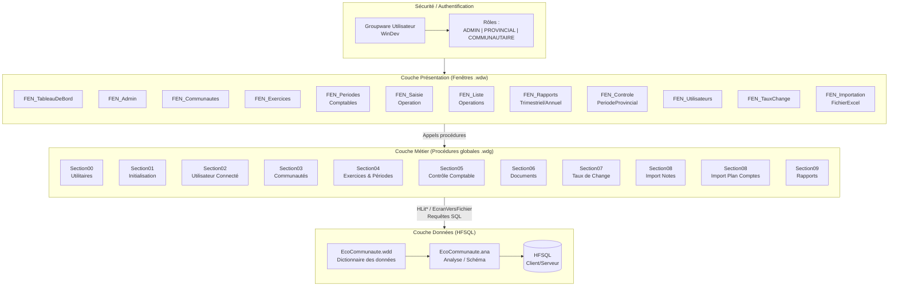
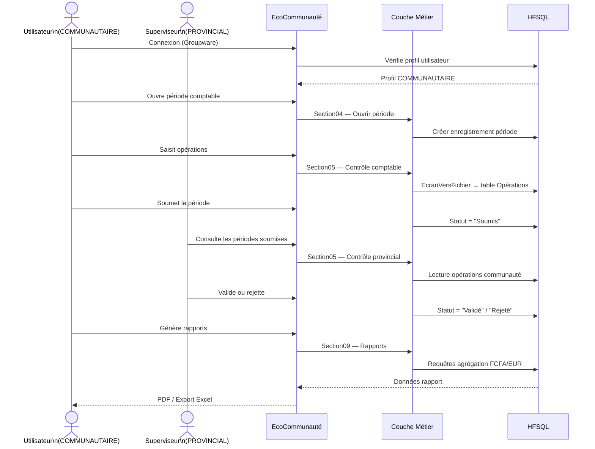
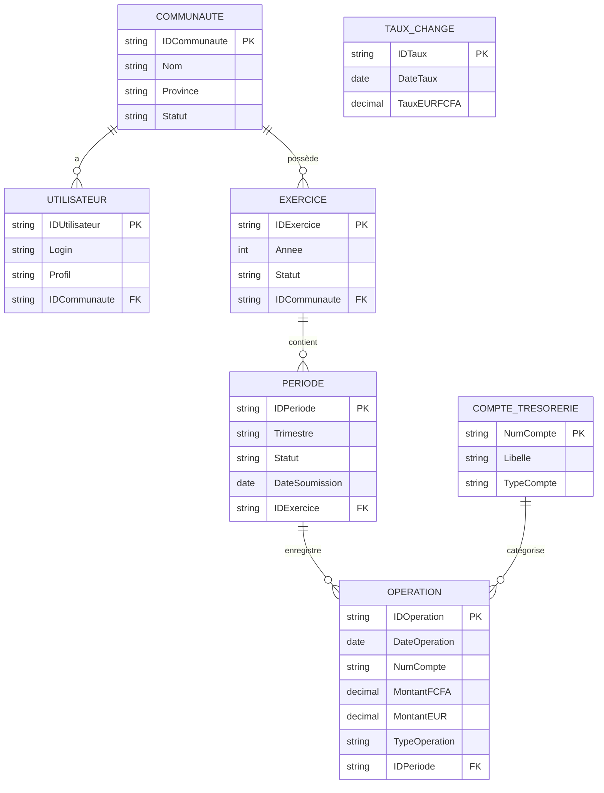

# Architecture — EcoCommunauté

## Vue d'ensemble

L'application suit une architecture **3-tiers** avec séparation claire des responsabilités, conformément aux recommandations WinDev 2025.

---

## Diagramme d'architecture global

---

## Flux fonctionnel principal

---

## Diagramme des modules fonctionnels

```mermaid
graph LR
    subgraph ADM["Administration"]
        A1[Communautés]
        A2[Utilisateurs]
        A3[Exercices fiscaux]
        A4[Taux de change]
    end

    subgraph CPT["Comptabilité"]
        C1[Périodes comptables]
        C2[Saisie opérations]
        C3[Comptes trésorerie]
        C4[Import plan de comptes]
        C5[Import notes]
    end

    subgraph CTL["Contrôle Provincial"]
        P1[Révision des périodes]
        P2[Validation / Rejet]
        P3[Observations]
    end

    subgraph RPT["Reporting"]
        R1[Rapport trimestriel\ncommunautaire]
        R2[Rapport annuel\ncommunautaire]
        R3[Rapport annuel\nprovincial]
        R4[Tableau de bord]
    end

    ADM --> CPT
    CPT --> CTL
    CTL --> RPT
    ADM --> RPT
```

---

## Modèle de données simplifié

---

## Stratégie de migration vers WEBDEV

L'architecture 3-tiers adoptée dès maintenant facilite la migration future :

| Phase | Action | Effort |
|---|---|---|
| 1 | Extraire la couche métier en Webservices REST | Moyen |
| 2 | Convertir les fenêtres en pages WEBDEV via l'assistant | Faible |
| 3 | Héberger HFSQL en mode Cloud | Faible |
| 4 | Déployer en SaaS sur PCSCloud.net | Faible |

> WinDev 2025 fournit un assistant de passage WINDEV → WEBDEV qui analyse le code et génère un rapport des modifications à effectuer.
