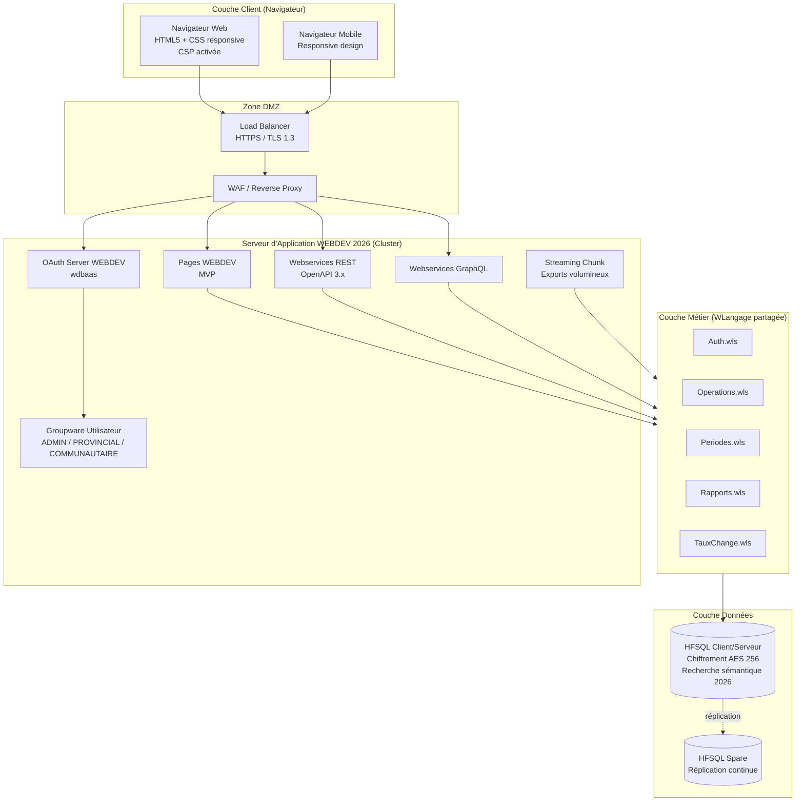
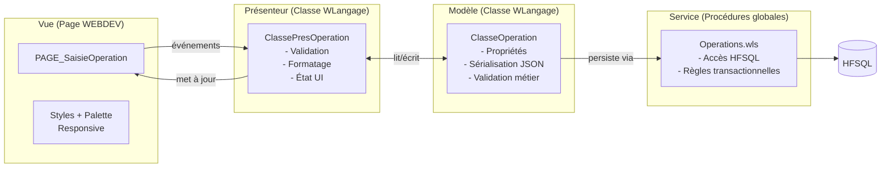
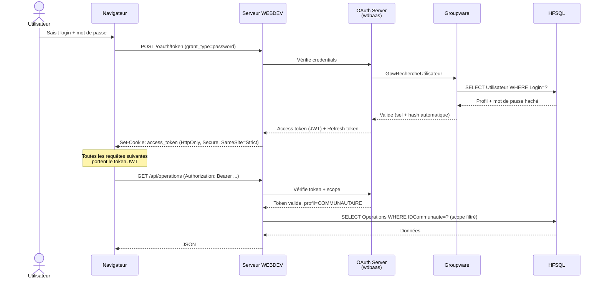
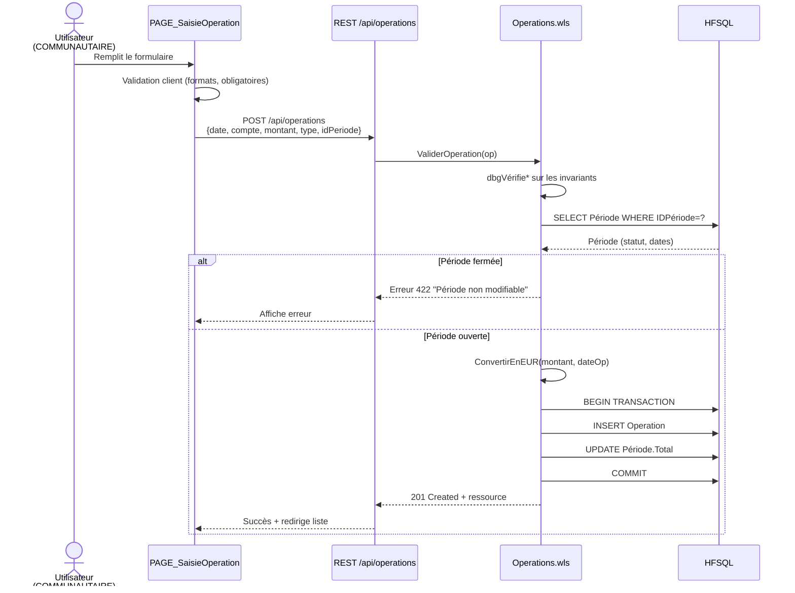
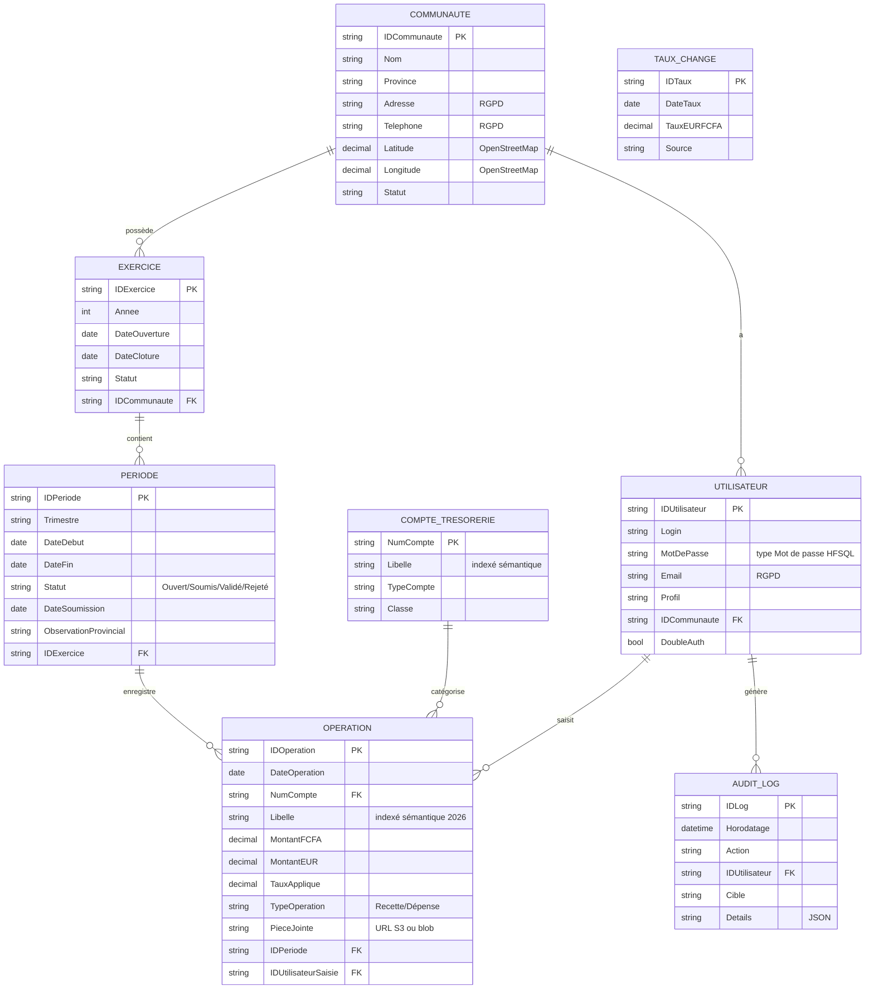
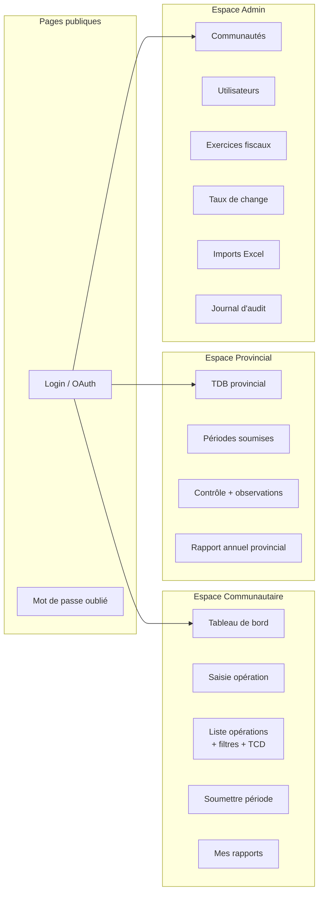
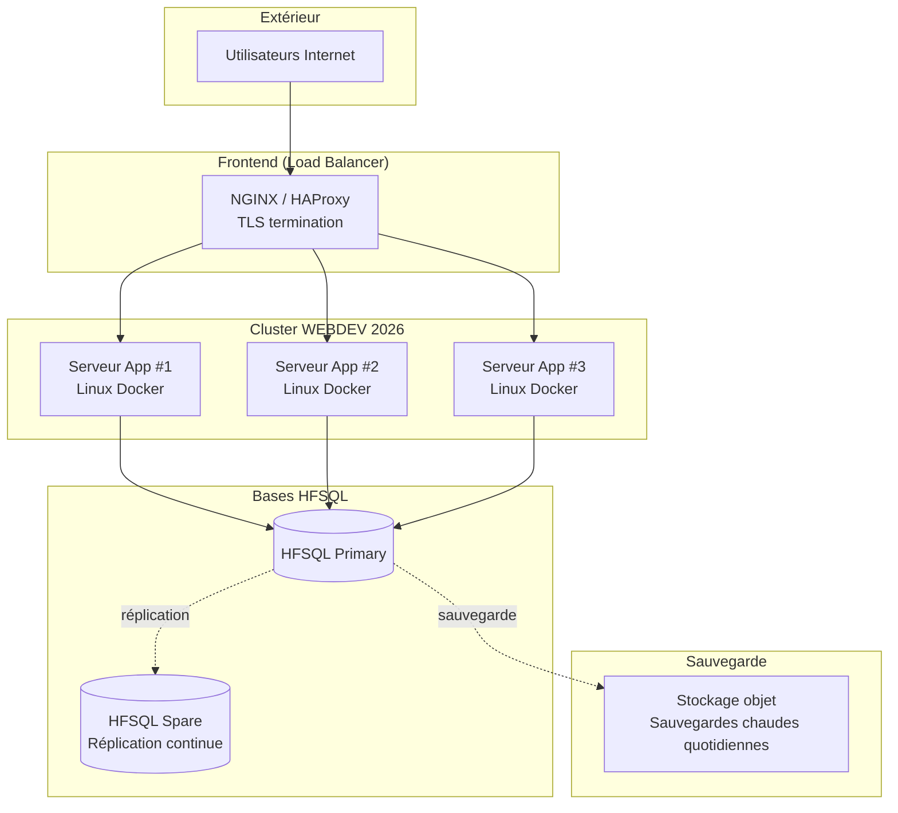
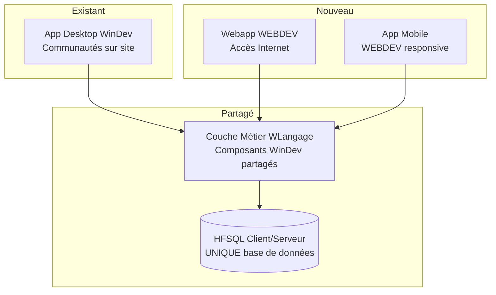

# Architecture — EcoCommunauté Web (WEBDEV 2026)

## Vue d'ensemble

Architecture **3-tiers stricte** avec séparation **MVP côté présentation** et exposition des services métier via **REST + GraphQL**, conformément aux bonnes pratiques WEBDEV 2026.

---

## Architecture globale

---

## Couche présentation — Pattern MVP

WEBDEV 2026 fournit le **RAD MVP** qui génère automatiquement les pages Fiche/Liste avec leurs états associés.

**Avantage :** la vue n'a aucune logique métier. Tests automatisés possibles sur le Présenteur sans navigateur.

---

## Flux d'authentification OAuth 2.0

---

## Flux de saisie d'opération (avec validation côté serveur)

---

## Modèle de données (HFSQL — partagé avec le desktop)

**Nouveauté 2026 :** les colonnes `Libelle` de `OPERATION` et `COMPTE_TRESORERIE` sont marquées **recherche sémantique** pour permettre une recherche intelligente (« virement carburant » trouve « essence véhicule »).

---

## Modules fonctionnels web

---

## Stratégie de déploiement — Cluster WEBDEV 2026

**Avantages du Cluster WEBDEV 2026 :**
- Haute disponibilité (un nœud peut tomber)
- Scalabilité horizontale (ajout de nœuds à chaud)
- Bascule automatique vers HFSQL Spare si Primary défaille

---

## Coexistence avec l'application desktop

Les communautés sur site (avec connexion intermittente) gardent l'app desktop. Les utilisateurs nomades et le superviseur provincial utilisent la webapp. **Pas de duplication des données ni du code métier.**
