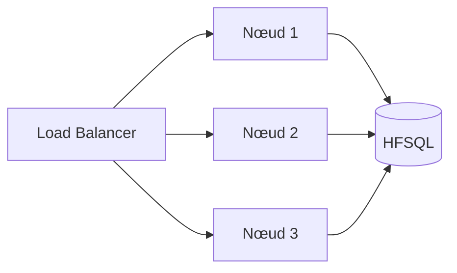

# Bonnes pratiques WEBDEV 2026

Synthèse des bonnes pratiques **WEBDEV 2026** appliquées au projet EcoCommunauté Web, basée sur la brochure officielle PC SOFT (900 nouveautés 2026).

---

## 1. Architecture

### 1.1 Pattern MVP avec RAD MVP (nouveauté 267)

WEBDEV 2026 génère automatiquement les pages **Fiche** et **Table** selon le pattern MVP, **avec les états associés**. Utiliser cette génération pour :
- Toutes les pages CRUD (Communautés, Utilisateurs, Comptes…)
- Les listes paginées avec recherche

Le code Vue / Modèle / Présenteur est cleanly séparé, facilitant les tests automatisés.

### 1.2 Architecture 3-tier stricte

- **Vue** = Pages WEBDEV (`PAGE_*.wwh`)
- **Présenteur** = Classes WLangage (`CL_Pres*.wcl`)
- **Modèle** = Classes WLangage (`CL_Modele*.wcl`)
- **Service** = Procédures globales serveur (`*.wls`)

Aucun accès `HLit*` direct dans les pages — passer par le présenteur → service.

### 1.3 Webservices REST + GraphQL en complément

Exposer la couche service via :
- **REST** (OpenAPI 3.x avec héritages — nouveauté 215) pour les actions et les exports
- **GraphQL** (nouveauté 144) pour les pages avec données multiples (dashboard)

---

## 2. Sécurité

### 2.1 Activer la CSP dès le départ (nouveauté 665)

```
Projet → Description → Sécurité → Activer CSP automatique
```

Voir [securite/CSP_configuration.md](../securite/CSP_configuration.md). **Critique** pour bloquer les XSS.

### 2.2 OAuth Server WEBDEV (nouveauté 2026)

Utiliser le serveur OAuth **intégré** au lieu de coder une authentification maison.

```wl
// Création d'un utilisateur
wdbaasCreeUtilisateur(login, mdp, scopes, attributs)

// Liste
wdbaasListeUtilisateurs(filtre)

// Modification
wdbaasModifieUtilisateur(id, nouveau_mdp, attributs)

// Suppression
wdbaasSupprimeUtilisateur(id)
```

### 2.3 Lancer l'audit de sécurité (nouveauté 2026)

```
Projet → Audits → Audit de sécurité
```

Détecte automatiquement :
- Compilation dynamique
- Communications Socket/SOAP/REST non sécurisées
- Mots de passe en dur
- Failles XSS / SQL injection potentielles

À lancer **avant chaque livraison**.

### 2.4 Double authentification systématique pour ADMIN

```wl
wdbaasModifieUtilisateur(idAdmin, Null,
    Variant(double_auth: Vrai))
```

### 2.5 Signature numérique par carte à puce (nouveauté 254-256)

Pour les rapports légaux ou financiers, utiliser la signature par certificat sur carte à puce. La clé privée ne quitte jamais la carte.

```wl
tabCert EST UN TABLEAU = CertificatListe()
PDFSigne(cheminRapport, tabCert[idChoix])
```

---

## 3. UI / UX

### 3.1 Utiliser le champ Grille (nouveauté 010-016)

Le **champ Grille** WEBDEV 2026 permet d'aligner les widgets sans positionnement au pixel. Combiné avec **flexbox**, il offre une UI parfaitement responsive.

**Cas d'usage idéal** : tableau de bord avec widgets, interfaces multilingues (les libellés changent de taille).

### 3.2 Utiliser une palette de couleurs (nouveauté 2026)

Définir une **palette** au niveau du projet. Tous les éléments (boutons, fonds, jauges, dégradés) y feront référence. Changer la palette = changer toute la charte en 1 clic.

### 3.3 Champs métier modernes (nouveautés 521-525)

| Champ métier | Usage EcoCommunauté |
|---|---|
| **Avis Google** | Page publique de présentation des communautés |
| **Profil réseaux sociaux** | Optionnel sur la fiche communauté |
| **Combo Popup avec filtre** | Sélection de compte de trésorerie (1000+ items) |
| **Boutons segmentés** | Sélecteur Recette/Dépense, FCFA/EUR |
| **Zone répétée événement** | Calendrier des soumissions à venir |

### 3.4 OpenStreetMap (nouveauté 2026)

Le champ **OpenStreetMap** remplace Google Maps :
- Pas de clé API requise
- Pas de coût
- Respecte le RGPD (pas de tracking utilisateur)

Idéal pour afficher les communautés sur une carte.

### 3.5 Hot Reload pendant le développement (nouveauté 259-266)

Activer le **Hot Reload** : les modifications de l'UI s'appliquent immédiatement dans le GO en cours, sans relancer la session de test.

```
Outils → Options → GO → Activer Hot Reload
```

Gain de productivité énorme lors du dev des pages.

---

## 4. Base de données HFSQL

### 4.1 Recherche sémantique (nouveauté 2026)

Pour les colonnes texte recherchées (libellés d'opérations, noms de comptes) :

```wl
// Création de l'index sémantique
HCréeIndexSémantique(Operation, "Libelle")

// Recherche : "carburant" trouve "essence", "gasoil", "plein"
tabRes EST UN TABLEAU = RechercheSémantique(Operation, "Libelle", "carburant", 20)
```

**Nettement supérieur** à la recherche full-text classique. Adapté aux libellés courts en français.

### 4.2 Tables inaltérables pour la conformité

Activer le mode **inaltérable** sur la table `AUDIT_LOG` :
- Une fois une ligne ajoutée, elle ne peut plus être modifiée ni supprimée
- Conforme aux normes de traçabilité financière

```wl
HCréeTable(AUDIT_LOG, hInalterable)
```

### 4.3 Type "Mot de passe" HFSQL

Pour toute colonne stockant un mot de passe, utiliser le type **"Mot de passe"** :
- Hachage + salage automatique
- Même volé, ne peut pas être reconstitué

### 4.4 Chiffrement AES 256

Connexion chiffrée systématique entre Serveur d'Application et HFSQL :

```wl
HOuvreConnexion("EcoCommunaute", "wdadmin", "***",
    "hfsql.ecocommunaute.org:4900",
    hAccèsHFSQLCS, hOLeDB, "AES256")
```

### 4.5 Cluster HFSQL pour la haute dispo

Configurer un **cluster HFSQL** avec :
- N serveurs en lecture (load balancing automatique)
- 1 serveur Spare pour la réplication

L'app web continue de fonctionner si un nœud tombe.

---

## 5. Performance

### 5.1 Webservices en streaming (nouveauté 213-214)

Pour les exports > 5000 lignes ou les téléchargements > 50 Mo, utiliser le **streaming HTTP Chunk** :

```wl
HTTPRéponseStream("...")  // envoie un chunk
HTTPRéponseFlush()        // force l'envoi
```

Évite les OOM serveur et donne un retour utilisateur immédiat.

### 5.2 Calculs asynchrones (nouveauté 020, 286)

`HExécuteProcédureAsynchrone` et `tcdCalculeToutAsynchrone` permettent de ne pas bloquer l'UI pendant les longs traitements.

```wl
HExécuteProcédureAsynchrone(GenererRapportComplet, idJob)
// La page renvoie immédiatement, le job tourne en arrière-plan
```

### 5.3 IA conversationnelle dans l'éditeur (nouveauté 001-009)

Utiliser l'IA intégrée pour :
- Générer des requêtes complexes ("Crée une requête qui sélectionne les recettes du trimestre par compte")
- Refactorer du code
- Documenter les procédures

L'IA a accès à tout le projet (analyse, code, fenêtres) et donne des réponses contextuelles.

### 5.4 Audit dynamique avec ATR

Lancer l'**Analyseur Temps Réel** sur la pré-production pour :
- Détecter les lenteurs
- Identifier les threads bloqués
- Voir les requêtes les plus lentes

---

## 6. Tests

### 6.1 Tests automatisés multi-navigateurs

L'outil de tests automatisés WEBDEV 2026 supporte Chrome, Firefox, Edge. Créer des tests pour :
- Tous les chemins critiques (login, saisie, soumission, validation)
- Les conversions FCFA/EUR (vérifier la précision)
- Les exports (PDF/Excel valides)
- Les permissions (un user X ne peut pas voir une donnée Y)

### 6.2 Tests de charge

Outil `wdtcc` (Test de Charge Continue) pour simuler N utilisateurs simultanés. Cibler :
- 50 saisies/min en heure de pointe (fin de mois)
- 100 consultations rapports/jour

### 6.3 CI/CD avec la Fabrique Logicielle

Configurer un pipeline automatique :

```
Commit Git → Build WEBDEV → Audit statique → Tests auto → Déploiement pré-prod → Tests d'acceptation → Déploiement prod
```

---

## 7. Déploiement

### 7.1 Cluster WEBDEV 2026 (nouveauté 3408)

Plateforme pré-configurée pour déployer en production :
- N serveurs WEBDEV en parallèle
- Bascule automatique en cas de défaillance
- Scalabilité horizontale à chaud



### 7.2 Conteneurs Linux Docker

Une **image Docker** du Serveur d'Application WEBDEV est fournie. Idéale pour :
- Déploiement sur Kubernetes
- Auto-scaling cloud (AWS ECS, Azure Container Apps, GCP Cloud Run)
- Isolation et reproductibilité

### 7.3 Activation à chaud des services (nouveauté 3290)

OAuth, Store, Groupware, etc. peuvent être activés **sans redémarrer** le serveur en cours d'utilisation. Aucune coupure de service.

---

## 8. Versioning et collaboration

### 8.1 GDS avec historisation locale (nouveauté 2026)

Le GDS conserve un historique local des modifications, même hors ligne. Utile pour les développeurs en déplacement.

### 8.2 Format texte hybride YAML pour Git

Activer le format texte pour permettre des diffs lisibles sur GitHub.

```
Projet → Description → Mode de sauvegarde → Format texte hybride YAML
```

### 8.3 Branches Git pour les versions

| Branche | Usage |
|---|---|
| `main` | Production stable |
| `develop` | Intégration continue |
| `feature/xxx` | Développement d'une fonctionnalité |
| `hotfix/xxx` | Correction urgente sur prod |

---

## 9. Conformité

### 9.1 RGPD

- Marquer toutes les colonnes contenant des données personnelles dans l'analyse (case RGPD)
- Lancer le rapport d'audit RGPD avant chaque mise en production
- Implémenter le droit à l'effacement (API admin pour anonymiser un utilisateur)

### 9.2 Facturation électronique (nouveauté 2026)

Pour les rapports financiers exportés vers les autorités, supporter le format **Factur-X** (PDF + XML EN16931 embarqué).

### 9.3 Tables inaltérables pour l'audit

`AUDIT_LOG` en mode inaltérable garantit que les traces ne peuvent pas être effacées (conformité NF525, eIDAS).

---

## 10. Observabilité

### 10.1 Télémétrie WEBDEV intégrée

Activer la télémétrie sur le Serveur d'Application pour collecter :
- Pages les plus consultées
- Temps de réponse
- Erreurs serveur
- Sessions actives

### 10.2 Alertes automatiques

Configurer des alertes sur :
- Pic de violations CSP (potentielle attaque)
- Pic d'échecs de login (brute force)
- Taux d'erreur > 1%
- Temps de réponse > 2 s sur le dashboard

---

## Checklist projet WEBDEV 2026

| # | Pratique | Priorité |
|---|---|---|
| 1 | CSP activée et configurée | **Critique** |
| 2 | OAuth Server WEBDEV configuré (pas d'auth maison) | **Critique** |
| 3 | Double authentification obligatoire pour ADMIN | **Critique** |
| 4 | Chiffrement AES 256 entre serveur app et HFSQL | **Critique** |
| 5 | Type "Mot de passe" HFSQL pour tous les mots de passe | **Critique** |
| 6 | Audit de sécurité passé avant chaque livraison | **Critique** |
| 7 | Tables inaltérables pour l'audit | **Critique** |
| 8 | Architecture MVP avec séparation Vue/Présenteur/Modèle/Service | **Haute** |
| 9 | RAD MVP utilisé pour les pages CRUD | **Haute** |
| 10 | GraphQL pour les pages multi-données (dashboard) | **Haute** |
| 11 | REST pour les actions et exports | **Haute** |
| 12 | Streaming Chunk pour les exports volumineux | **Haute** |
| 13 | Recherche sémantique HFSQL sur les libellés | **Haute** |
| 14 | Tests automatisés sur les chemins critiques | **Haute** |
| 15 | Palette de couleurs définie au niveau projet | **Haute** |
| 16 | Hot Reload activé en dev | Moyenne |
| 17 | Cluster WEBDEV en production | Moyenne |
| 18 | Conteneurs Docker pour déploiement | Moyenne |
| 19 | OpenStreetMap au lieu de Google Maps | Moyenne |
| 20 | Format texte hybride pour Git | Moyenne |
| 21 | Télémétrie + alertes configurées | Moyenne |
| 22 | Marquage RGPD des colonnes | Moyenne |
| 23 | Signature carte à puce pour rapports légaux | Basse |
| 24 | IA conversationnelle utilisée en dev | Basse |
