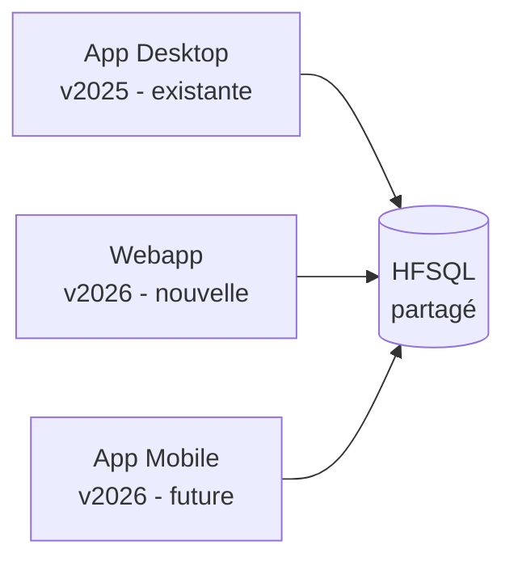

# Migration WinDev → WEBDEV 2026

Guide opérationnel pour porter l'application desktop existante vers la webapp WEBDEV 2026, en suivant la **webisation progressive** recommandée par PC SOFT.

---

## Principe : pas de big-bang

PC SOFT recommande deux approches :

1. **Conversion complète** — Convertir le projet WinDev en projet WEBDEV en une fois
2. **Webisation progressive** ← **recommandée pour EcoCommunauté**

La progressive permet de :
- Garder l'app desktop en production pendant le développement web
- Migrer les modules un par un (priorité métier)
- Réutiliser au maximum le code WLangage existant
- Tester en parallèle

---

## Étapes de migration

### Phase 0 — Préparation (1 semaine)

| Action | Détail |
|---|---|
| Vérifier la version WinDev | Si < 2025, migrer d'abord vers 2025 ou 2026 |
| Sauvegarder le projet desktop | Versionner avant toute modification |
| Demander un audit de webisation à PC SOFT | Service gratuit qui identifie les blocages |
| Activer le format texte hybride YAML | Pour le versioning Git du futur projet WEBDEV |
| Provisionner un serveur HFSQL Client/Serveur | Si pas déjà fait (l'app desktop peut être en HFSQL Classic local) |

---

### Phase 1 — Migration des données (1 semaine)

L'analyse HFSQL est **partagée** entre desktop et web. Aucune migration de données nécessaire si l'app desktop est déjà en HFSQL C/S.

| Action | Code WLangage |
|---|---|
| Migrer HFSQL Classic → HFSQL C/S | `HConvertit(EcoCommunaute, hConvertitHFCS)` |
| Configurer le chiffrement AES 256 | `HOuvreConnexion(..., hChiffréAES256)` |
| Marquer les colonnes RGPD | Éditeur d'analyse → propriété RGPD |
| Activer la recherche sémantique (nouveauté 2026) | `HCréeIndexSémantique(Operation, "Libelle")` |

---

### Phase 2 — Extraction de la couche métier (2-3 semaines)

Le code WLangage des sections `Section0X_*.wdg` est **réutilisable tel quel** côté WEBDEV. Mais il faut le séparer du code UI.

#### Mapping des sections desktop → procédures web

| Desktop (.wdg) | Web (procedure .wls) | État |
|---|---|---|
| `Section00_Utilitaires` | `webapp/procedures/Utilitaires.wls` | Réutilisable à 100% |
| `Section01_Initialisation` | Adapté en init OAuth | À réécrire |
| `Section02_Utilisateur_Connecte` | `webapp/procedures/Auth.wls` | Remplacé par OAuth |
| `Section03_Communautes` | `webapp/procedures/Communautes.wls` | Réutilisable |
| `Section04_Exercices_Periodes` | `webapp/procedures/Periodes.wls` | Réutilisable |
| `Section05_Controle_Comptable` | `webapp/procedures/Operations.wls` | Réutilisable |
| `Section06_Documents` | `webapp/procedures/Documents.wls` | À adapter (upload web) |
| `Section07_TauxChange` | `webapp/procedures/TauxChange.wls` | Réutilisable |
| `Section08_ImportNotes` | `webapp/procedures/Imports.wls` | À adapter (upload web) |
| `Section08_ImportPlanCompte` | `webapp/procedures/Imports.wls` | À adapter |
| `Section09_Rapports` | `webapp/procedures/Rapports.wls` | Réutilisable |

#### Refactoring requis

Recherchez dans le code desktop les appels qui n'existent pas en WEBDEV (assistant de migration WEBDEV 2026 fait ça automatiquement) :

| Pattern desktop à supprimer | Remplacement web |
|---|---|
| `Multitâche()`, threads sous Windows | `HExécuteProcédureAsynchrone` (nouveauté 2026) |
| Accès direct au registre Windows | Configuration fichier ou base |
| `LanceAppli("notepad.exe")` | Pas d'équivalent — repenser le flux |
| `dPixelCouleur` sur l'écran | Pas d'accès direct au DOM |
| `fSauve` sur disque local | Upload vers le serveur via REST |
| Lecture/écriture fichiers locaux | Stockage objet (S3 ou local serveur) |

---

### Phase 3 — Création du projet WEBDEV (1 jour)

```
WEBDEV 2026 → Nouveau projet → Projet vierge
```

| Paramètre | Valeur |
|---|---|
| Nom | `EcoCommunaute_Web` |
| Gabarit | Sélectionner un gabarit moderne avec palette |
| Mode session | **Session** (PHP-like) ou **AWP** (stateless) → recommandé : **AWP** |
| Charset | UTF-8 |
| Mode CSP | **Activé** (nouveauté 2026) |
| Format de sauvegarde | Texte hybride YAML (pour Git) |
| Architecture cible | MVP avec composants |
| Sessions | OAuth (pas Groupware classique) |

---

### Phase 4 — Conversion des fenêtres en pages (3-4 semaines)

L'assistant de webisation WEBDEV 2026 (nouveauté améliorée) accélère cette phase.

#### Mapping fenêtres → pages

| Fenêtre desktop | Page web | Notes |
|---|---|---|
| `FEN_Login` (implicite via Groupware) | `PAGE_Login` | Refait via OAuth |
| `FEN_TableauDeBord` | `PAGE_TableauDeBord` | Repensé avec Grille 2026 + GraphQL |
| `FEN_SaisieOperation` | `PAGE_SaisieOperation` | Adapté responsive |
| `FEN_SaisieOperationSimple` | Fusionné dans `PAGE_SaisieOperation` | Élimination doublon |
| `FEN_ListeOperations` | `PAGE_ListeOperations` | + TCD Web 2026 + recherche sémantique |
| `FEN_DetailOperation` | Modal dans `PAGE_ListeOperations` | Pas une page entière |
| `FEN_DetailOperationProvincial` | Onglet dans `PAGE_ControleProvincial` | Consolidation UX |
| `FEN_PeriodesComptablesCommunaute` | `PAGE_PeriodesCommunaute` | Conversion directe |
| `FEN_PeriodesComptablesAdmin` | `PAGE_Admin/Periodes` | Sous-page admin |
| `FEN_ControlePeriodeProvincial` | `PAGE_ControleProvincial` | Cœur du module provincial |
| `FEN_SaisieObservation` | Modal | UX moderne |
| `FEN_RapportTrimestrielCommunautaire` | `PAGE_Rapports?type=trimestriel` | Page unique paramétrée |
| `FEN_RapportAnnuelFinalCommunautaire` | `PAGE_Rapports?type=annuel_comm` | Idem |
| `FEN_RapportAnnuelFinalProvincial` | `PAGE_Rapports?type=annuel_prov` | + signature carte à puce 2026 |
| `FEN_DetailRapport` | Modal | UX moderne |
| `FEN_DetailRapportOLD` | **Supprimé** | Code mort (cf audit) |
| `FEN_Communautes` | `PAGE_Admin/Communautes` | + carte OpenStreetMap 2026 |
| `FEN_Exercices` | `PAGE_Admin/Exercices` | |
| `FEN_Fiche_communaute` | Modal | |
| `FEN_Fiche_exercice` | Modal | |
| `FEN_Fiche_utilisateur` | Modal | |
| `FEN_Utilisateurs` | `PAGE_Admin/Utilisateurs` | via wdbaas 2026 |
| `FEN_Table_utilisateur` | Fusionné dans `PAGE_Admin/Utilisateurs` | Consolidation |
| `FEN_TauxChange` | `PAGE_Admin/TauxChange` | + récup auto BCEAO |
| `FEN_TauxChange_1` | **Supprimé** | Doublon (cf audit) |
| `FEN_Importation_Fichier_Excel` | `PAGE_Admin/Imports` | Upload web |
| `FEN_LectureNoteCompte` | Modal dans Imports | |
| `FEN_Notes` | `PAGE_Notes` | |
| `FEN_ComptesTresorerie` | `PAGE_Admin/Comptes` | + recherche sémantique |
| `FEN_Admin` | Remplacée par `/admin/*` (routing) | Pas une page unique |

**Résultat :** ~12 pages web vs 30+ fenêtres desktop (consolidation par modaux et tabs).

---

### Phase 5 — Webservices REST + GraphQL (2 semaines)

Voir [webservices/REST_API_specification.md](../webservices/REST_API_specification.md) et [webservices/GraphQL_schema.md](../webservices/GraphQL_schema.md).

L'assistant WEBDEV génère automatiquement :
- Les wrappers REST à partir des classes
- Le schéma GraphQL à partir des types
- Le swagger OpenAPI 3.x

---

### Phase 6 — Sécurité (1 semaine)

| Action | Document |
|---|---|
| Activer CSP | [securite/CSP_configuration.md](../securite/CSP_configuration.md) |
| Configurer OAuth Server | [securite/OAuth_setup.md](../securite/OAuth_setup.md) |
| Activer 2FA pour ADMIN | Idem |
| Audit de sécurité (nouveauté 2026) | Menu Projet → Audits → Audit de sécurité |

---

### Phase 7 — Tests & déploiement (2 semaines)

| Action | Détail |
|---|---|
| Tests automatisés | Reprendre les tests desktop + ajouter tests web (Selenium-like via WEBDEV) |
| Tests de charge | Outil `wdtcc` pour simuler 100+ utilisateurs |
| Audit dynamique | Sur env de pré-prod |
| Déploiement Cluster | 3 nœuds Linux Docker (cf cluster_webdev) |
| HFSQL Spare | Pour la haute dispo |
| Monitoring | Outil de télémétrie WEBDEV intégré |

---

## Coexistence desktop + web pendant la migration

Pendant que la webapp se construit, l'app desktop reste utilisable. Les deux apps partagent :

- **La même base HFSQL** (un seul jeu de données)
- **Les mêmes utilisateurs** (Groupware + OAuth)
- **Le même code métier** (composants WinDev partagés)



Cette coexistence permet de migrer **module par module** :
1. Le tableau de bord web est dispo → utilisateurs power users testent
2. La saisie web est dispo → on bascule progressivement
3. Le module provincial web → le superviseur bascule
4. L'admin web → l'admin bascule
5. L'app desktop est figée puis désactivée

---

## Estimation de l'effort

| Phase | Durée | Équipe |
|---|---|---|
| 0 — Préparation | 1 sem | 1 dev |
| 1 — Migration données | 1 sem | 1 dev + 1 DBA |
| 2 — Extraction métier | 2-3 sem | 2 devs |
| 3 — Création projet WEBDEV | 1 j | 1 dev |
| 4 — Conversion pages | 3-4 sem | 2 devs + 1 designer |
| 5 — Webservices | 2 sem | 1 dev |
| 6 — Sécurité | 1 sem | 1 dev + audit externe |
| 7 — Tests & déploiement | 2 sem | 2 devs + 1 ops |
| **Total** | **~3 mois** | **2-3 devs** |

---

## Bénéfices attendus

| Avant (desktop) | Après (web) |
|---|---|
| Installation sur chaque poste | Accès navigateur, zéro install |
| Mise à jour par DMA | Mise à jour instantanée serveur |
| Pas d'accès depuis l'extérieur | Accessible 24/7 depuis Internet |
| Pas d'accès mobile | Responsive natif |
| 1 environnement par communauté | 1 environnement centralisé |
| Pas de carte des communautés | Carte OpenStreetMap intégrée |
| Pas d'API pour intégrations tierces | REST + GraphQL exposés |
| Saisie limitée au PC du bureau | Saisie depuis n'importe quel device |
