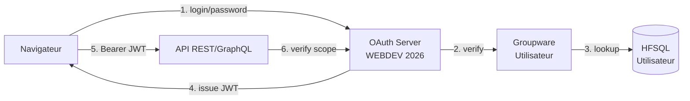

# Configuration OAuth Server — EcoCommunauté Web

> **Nouveauté WEBDEV 2026** : le Serveur d'Application WEBDEV inclut un **serveur OAuth 2.0 prêt à l'emploi**, administrable en WLangage via la famille de fonctions `wdbaas` (BaaS = Backend as a Service).

---

## Architecture d'authentification



---

## Configuration côté Serveur d'Application

### Activation du serveur OAuth

```
Administration WEBDEV → Serveurs OAuth → Nouveau serveur
```

| Paramètre | Valeur EcoCommunauté |
|---|---|
| Nom du serveur | `ecocommunaute-auth` |
| URL d'émission | `https://api.ecocommunaute.org/oauth` |
| Type de grant | Password + Refresh Token |
| Durée access_token | 1 heure |
| Durée refresh_token | 30 jours |
| Algorithme JWT | RS256 (asymétrique) |
| Stockage des clés | KMS / fichier chiffré |

---

### Scopes définis

| Scope | Profil | Permissions |
|---|---|---|
| `communaute_read` | Tous | Lecture des données de sa communauté |
| `communaute_write` | COMMUNAUTAIRE | Saisie/modification des opérations |
| `provincial_read` | PROVINCIAL | Lecture des données de sa province |
| `provincial_validate` | PROVINCIAL | Valider/rejeter les périodes |
| `admin_full` | ADMIN | Toutes les actions |
| `reports_generate` | Tous | Générer les rapports autorisés |
| `audit_read` | ADMIN | Consultation du journal d'audit |

---

## Administration en WLangage (nouveauté 2026)

### Créer un utilisateur

```wl
// procedures/UtilisateursAdmin.wls

PROCÉDURE Utilisateurs_Creer(clNouveau EST UN ClasseUtilisateur) : ClasseResultat

// Génération d'un mot de passe initial fort
sMotDePasse EST UNE CHAÎNE = GenererMotDePasseFort(16)

// Détermination des scopes selon le profil
sScopes EST UNE CHAÎNE
SELON clNouveau.Profil
    CAS "COMMUNAUTAIRE"
        sScopes = "communaute_read,communaute_write,reports_generate"
    CAS "PROVINCIAL"
        sScopes = "communaute_read,provincial_read,provincial_validate,reports_generate"
    CAS "ADMIN"
        sScopes = "admin_full,audit_read,reports_generate"
FIN

// Création via wdbaas (nouveauté 2026)
clRes EST UN ClasseResultat = wdbaasCreeUtilisateur(
    clNouveau.Login,
    sMotDePasse,
    sScopes,
    Variant(
        profil: clNouveau.Profil,
        id_communaute: clNouveau.IDCommunaute,
        province: clNouveau.Province,
        double_auth: clNouveau.DoubleAuth
    )
)

SI clRes.Succes ALORS
    EnvoyerEmailBienvenue(clNouveau.Email, clNouveau.Login, sMotDePasse)
FIN

RENVOYER clRes
```

### Lister les utilisateurs (nouveauté 2026)

```wl
PROCÉDURE Utilisateurs_Lister(sFiltre EST UNE CHAÎNE = "") : TABLEAU

tabUsers EST UN TABLEAU = wdbaasListeUtilisateurs(sFiltre)
RENVOYER tabUsers
```

### Modifier un utilisateur (nouveauté 2026)

```wl
PROCÉDURE Utilisateurs_Modifier(idUser EST UNE CHAÎNE,
                                 clMaj EST UN ClasseUtilisateur)

wdbaasModifieUtilisateur(idUser, Null,  // pas de changement de mdp
    Variant(
        profil: clMaj.Profil,
        id_communaute: clMaj.IDCommunaute,
        province: clMaj.Province,
        double_auth: clMaj.DoubleAuth
    ))
```

### Supprimer un utilisateur (nouveauté 2026)

```wl
PROCÉDURE Utilisateurs_Supprimer(idUser EST UNE CHAÎNE)

// Soft delete recommandé pour garder l'historique d'audit
wdbaasModifieUtilisateur(idUser, Null,
    Variant(actif: Faux, date_desactivation: MaintenantSys()))

AuditLog("USER_DEACTIVATE", idUser)
```

### Rechercher un utilisateur (nouveauté 2026 — fonctionne en mode BaaS)

```wl
PROCÉDURE Utilisateurs_RechercherParEmail(sEmail EST UNE CHAÎNE) : ClasseUtilisateur

// GpwRechercheUtilisateur supporte maintenant le mode BaaS
clUser EST UN ClasseUtilisateur = GpwRechercheUtilisateur(sEmail, gpwParEmail)
RENVOYER clUser
```

---

## Double authentification (2FA)

Le serveur OAuth supporte TOTP (Time-based One-Time Password, compatible Google Authenticator, Microsoft Authenticator, Authy).

### Activation pour un utilisateur

```wl
PROCÉDURE Activer2FA(idUser EST UNE CHAÎNE) : CHAÎNE

// Génère un secret partagé
sSecret EST UNE CHAÎNE = GenererSecretTOTP(32)

// Stocke côté serveur (chiffré)
wdbaasModifieUtilisateur(idUser, Null,
    Variant(double_auth: Vrai, totp_secret: sSecret))

// Renvoie l'URL otpauth:// pour le QR code
sLogin EST UNE CHAÎNE = wdbaasInformationsUtilisateur(idUser).preferred_username
sURL EST UNE CHAÎNE = ChaîneConstruit(
    "otpauth://totp/EcoCommunaute:%1?secret=%2&issuer=EcoCommunaute",
    sLogin, sSecret)

RENVOYER sURL  // Le client génère le QR code à partir de cette URL
```

---

## Flow d'authentification — Séquence complète

### Step 1 — Login initial

```http
POST /oauth/token HTTP/1.1
Content-Type: application/x-www-form-urlencoded

grant_type=password&username=marie.dupont&password=xxxxx&client_id=ecocommunaute-web
```

**Réponse (si 2FA non requis)**
```json
{
  "access_token": "eyJhbGc...",
  "token_type": "Bearer",
  "expires_in": 3600,
  "refresh_token": "eyJhbGc...",
  "scope": "communaute_read communaute_write reports_generate"
}
```

**Réponse (si 2FA requis)**
```json
{
  "error": "interaction_required",
  "error_description": "2FA verification needed",
  "session_id": "uuid-temporaire"
}
```

### Step 2 — Validation 2FA

```http
POST /oauth/2fa/verify HTTP/1.1
Content-Type: application/json

{
  "session_id": "uuid-temporaire",
  "code": "123456"
}
```

### Step 3 — Utilisation du token

```http
GET /api/operations?periode=xxx HTTP/1.1
Authorization: Bearer eyJhbGc...
```

### Step 4 — Refresh quand expiré

```http
POST /oauth/token HTTP/1.1
Content-Type: application/x-www-form-urlencoded

grant_type=refresh_token&refresh_token=eyJhbGc...
```

### Step 5 — Logout (révocation)

```http
POST /oauth/revoke HTTP/1.1
Authorization: Bearer eyJhbGc...
```

---

## Bonnes pratiques

| Pratique | Justification |
|---|---|
| **Stocker l'access_token en cookie HttpOnly + Secure + SameSite=Strict** | Empêche le vol via XSS et CSRF |
| **JAMAIS de token en localStorage** | Vulnérable à XSS |
| **Rotation des refresh_tokens** | Un refresh_token utilisé est invalidé et remplacé |
| **Détection de réutilisation** | Si un refresh_token déjà invalidé est utilisé → révoquer toute la session (probable vol) |
| **IP whitelisting pour ADMIN** | Sécurité supplémentaire pour le profil le plus sensible |
| **Audit obligatoire de tous les events OAuth** | Login, logout, refresh, échec, révocation |
| **Algorithme RS256** | Pas HS256 (clé symétrique exposée) |
| **Pas d'introspection publique** | L'endpoint `/oauth/introspect` est réservé aux services internes |

---

## Tests à effectuer

1. Login OK → token JWT valide pendant 1 h
2. Token expiré → refresh → nouveau token
3. Refresh token réutilisé → toute la session révoquée + alerte
4. Login depuis IP inhabituelle (ADMIN) → bloqué ou 2FA forcé
5. Scope insuffisant → 403
6. Token forgé manuellement → 401 (signature invalide)
7. Logout → token + refresh révoqués
